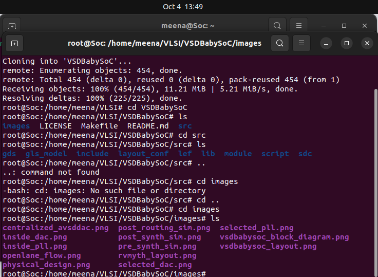
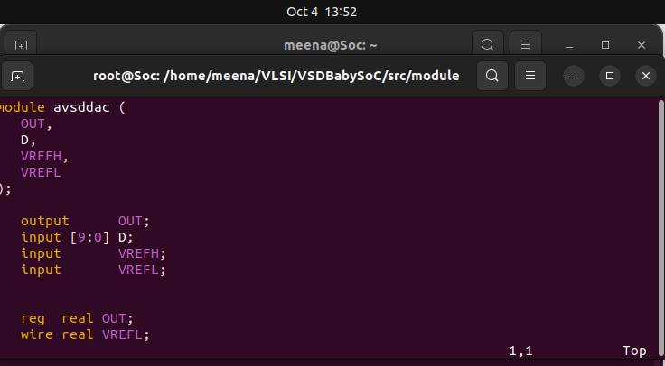
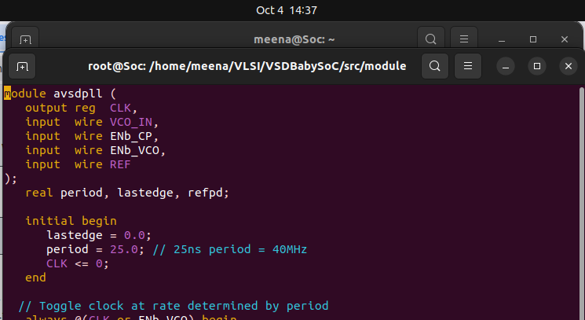
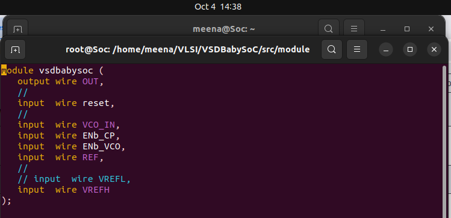
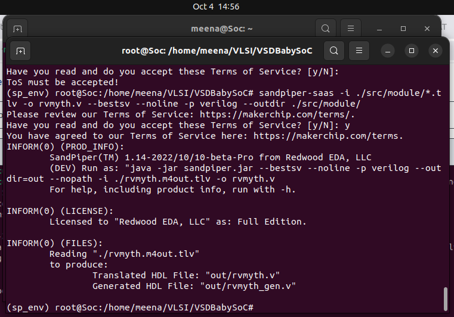

# ⚙️ BABYSoC - FUNCTIONAL MODELLING

This documentation covers the **hands-on functional modeling of BabySoC**, focusing on building a strong understanding of **SoC fundamentals**. It guides you through simulating and analyzing the design using **Icarus Verilog** for functional verification and **GTKWave** for waveform visualization.

---

|📑 Table of Contents|
|-------------|
|1. [Cloning the VSDBabySoC Repository](#1-cloning-the-vsdbabysoc-repository)|
|2. [Analysing the Contents of VSDBabySoC](#2-analysing-the-contents-of-vsdbabysoc)|
|3. [Pre-synthesis Simulation of VSDBabySoC](#3-pre-synthesis-simulation-of-vsdbabysoc)|
|4. [Signal Analysis](#4-signal-analysis)|
|5. [Summary](#5-summary)|

---

## 1. Cloning the VSDBabySoC Repository

```bash
cd ~/home/meena/VLSI    #Navigate to the folder where you want to store your project
```

```bash
git clone https://github.com/manili/VSDBabySoC.git     #Clone the repository
cd VSDBabySoC
```

```bash
ls    #Check its contents
```

---

## 2. Analysing the Contents of VSDBabySoC

### File structure

```ruby
VSDBabySoC/
├── LICENSE
├── Makefile
├── README.md
├── images/
    ├── centralized_avsddac.png
    ├── post_synth_sim.png
    ├── pre_synth_sim.png
    ├── rvmyth_layout.png
    ├── vsdbabysoc_block_diagram.png
    ├── centralized_avsddac.png  
|
└── src/
    ├── module/
    |   ├── avsddac.v
    |   ├── avsdpll.v
    |   ├── rvmyth.tlv
    |   └── vsdbabysoc.v
    ├── include/
    |   ├── sandpiper.vh
    |   ├── sandpiper_gen.vh
```



---

### 📂 Verilog Source Files (`*.v`)

| File           | Description                                                                      |
| -------------- | -------------------------------------------------------------------------------- |
| `avsddac.v`    | Implements the **DAC module**, converting 10-bit digital input to analog output. |
| `avsdpll.v`    | Implements the **PLL module**, generating a stable clock.                        |
| `rvmyth.tlv`   | TL-Verilog description of a **RISC-V CPU core**.                                 |
| `vsdbabysoc.v` | **Top-level integration**, connecting CPU, PLL, and DAC.                         |

#### Example: DAC Implementation (`avsddac.v`)



---

#### Example: PLL Implementation (`avsdpll.v`)



---

#### Example: Top-Level Integration (`vsdbabysoc.v`)



---

### 📂 Testbench (`testbench.v`)

The testbench:

* Provides **inputs** (`reset`, `REF`, etc.)
* Monitors **outputs** (`OUT`, `RV_TO_DAC`)
* Generates `.vcd` file for **waveform analysis**

---

## 3. Pre-synthesis Simulation of VSDBabySoC(rvmyth.tlv)

### Install dependencies

```bash
sudo apt install python3-venv python3-pip
python3 -m venv sp_env
source sp_env/bin/activate
pip3 install pyyaml click sandpiper-saas
```

>**Ensure sp_env is activated
>
>To activate:
>
>source sp_env/bin/activate
>
>deactivate #To deactivate
### Convert TL-Verilog → Verilog

```bash
sandpiper-saas -i ./src/module/*.tlv -o rvmyth.v --bestsv --noline -p verilog --outdir ./src/module/
```


✅ Produces `rvmyth.v` and `rvmyth_gen.v`.


---

### Compile design with Icarus Verilog

```bash
mkdir -p output/pre_synth_sim
iverilog -o /home/meena/VLSI/VSDBabySoC/output/pre_synth_sim/pre_synth_sim.out -DPRE_SYNTH_SIM -I /home/meena/VLSI/VSDBabySoC/src/include -I /home/meena/VLSI/VSDBabySoC/src/module /home/meena/VLSI/VSDBabySoC/src/module/testbench.v

```

### Run simulation & view waveforms

```bash
./pre_synth_sim.out
gtkwave pre_synth_sim.vcd
```

**Waveform:**


>In this picture we can see the following signals:
>
>CLK: This is the input CLK signal of the RVMYTH core. This signal comes from the PLL, originally.
>
>reset: This is the input reset signal of the RVMYTH core. This signal comes from an external source, originally.
>
>OUT: This is the output OUT signal of the VSDBabySoC module. This signal comes from the DAC (due to simulation restrictions it behaves like a digital signal which is incorrect), originally.
>
>RV_TO_DAC[9:0]: This is the 10-bit output [9:0] OUT port of the RVMYTH core. This port comes from the RVMYTH register #17, originally.
>
>OUT: This is a real datatype wire which can simulate analog values. It is the output wire real OUT signal of the DAC module. This signal comes from the DAC, originally.

---

## 4.RTL Simulation Modules

### avsdpll.v

**Testbench**  

Make a new file in /src/module named tb_avsddac.v  
>Follow these steps: 
>vim tb_avspll.v  
> #press i to get into insert mode  
>Paste the code and click 'Enter'  
>:wq #To write and save


**Synthesis**  

```

### avsdpll.v
vim tb_rvmyth.v
 iverilog -o /home/meena/VLSI/VSDBabySoC/output/rvymth/rvmyth.out -DPRE_SYNTH_SIM -I /home/meena/VLSI/VSDBabySoC/src/include -I /home/meena/VLSI/VSDBabySoC/src/module /home/meena/VLSI/VSDBabySoC/src/module/clk_gate.v /home/meena/VLSI/VSDBabySoC/src/module/rvmyth.v /home/meena/VLSI/VSDBabySoC/src/module/tb_rvmyth.v

vvp /home/meena/VLSI/VSDBabySoC/output/rvymth/rvmyth.out


## 5. Summary

* BabySoC integrates a **RISC-V CPU, PLL, and DAC**.
* Functional simulation validates design before synthesis.
* Using **Icarus Verilog + GTKWave**, we verified CPU → DAC interaction.
* This provides a practical introduction to **SoC functional modeling**.
